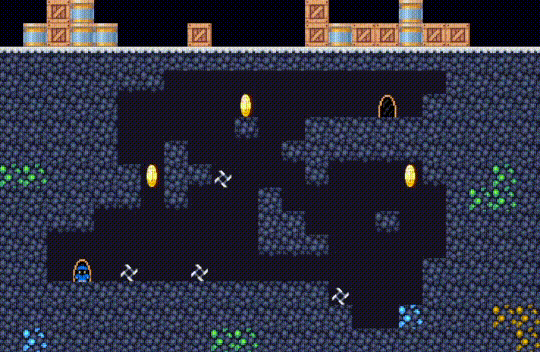

# Crushing Reality - JavaFX Game
Crushing Reality is a 2D game created using Java and JavaFX. The primary objective is to navigate through each level without succumbing to the dangers of razor-sharp traps while collecting coins to progress to the next level.


## Gameplay


## Getting Started:

1. **Clone the Repository:**
   ```bash
   git clone https://github.com/TheMikerik/Crushing-Reality
   ```
2. Run the Game:
    ```bash
    cd blade-runner
    javac BladeRunner.java
    java BladeRunner
    ```
3. Game Controls
    - W, A, S, D keys for movement
    - R key for respawn
    - Avoid blade traps to stay alive
    - Collect all coins to unlock the next level

Enjoy playing Crushing Reality! If you encounter any issues or have suggestions, please let me know. Happy gaming! 🎮

## Inspiration
[Original crushing reality game](https://gamaverse.com/crushing-reality-game/)